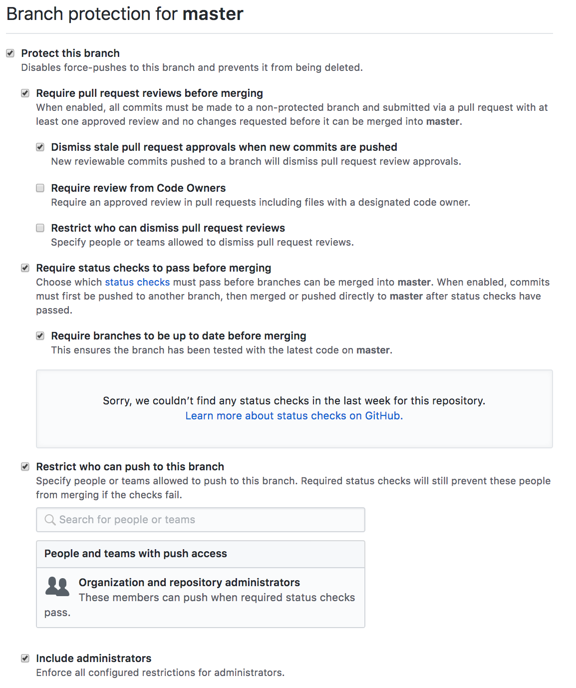
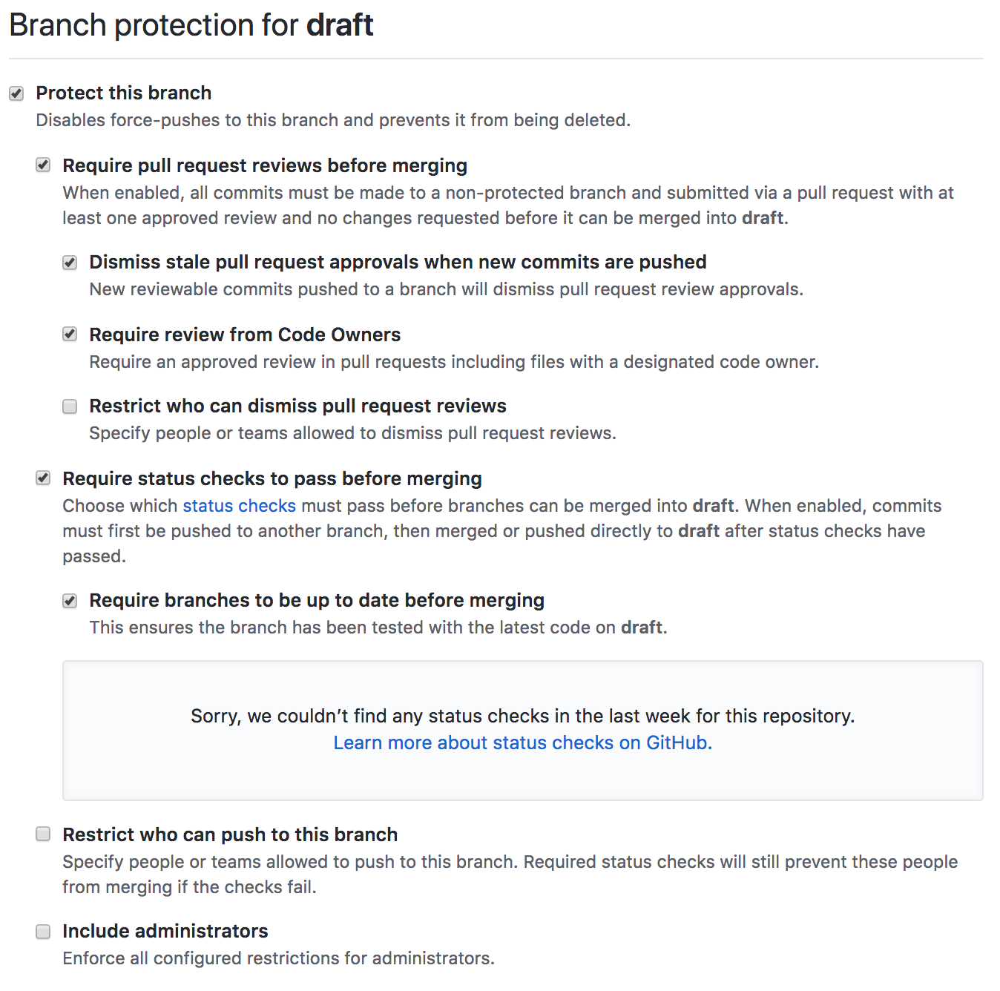

# New Format

This is about the new format we need to come up with and agree. Here at the beginning we’ll have our latest agreements and below we will have commentary about it.

## Current idea:

Let’s make a GitHub repo per release. Releases will take us 3 months to develop and will contain the following structure:

```
README.md
SUMMARY.md
ACKNOWLEDGEMENTS.md
CHANGELOG.md
LICENSE.md
media-reach.md
table-of-contents.md
essays/
tutorials/
tools/
interviews/
```

Where:

* **README.md** will hold information about the repo and the release, including details about the folder structure, a copy of the summary and information about TecnoYucas, how to consume our releases and how to participate

* **SUMMARY.md** will hold a Markdown version of a summary, for easy consumption from other tools

* **ACKNOWLEDGEMENTS.md** will be a list of people and organizations that might have participated or contributed indirectly. Direct participation will be evident through Git history and the repo visualizations provided by GitHub

* **CHANGELOG.md** will hold a summary of the changes that we will have done to the repo at the moment of the release, as well as subsequent revisions.

* **LICENSE.md** will hold a copy of the copyright license we’ll have. It will most likely be Creative Commons.

* **media-reach.md** will be a list of places where any version of the publication appears, including websites such as medium, blogposts and relevant social media treads and posts.

* **table-of-contents.md** will be an ordered list of links to the different contents in the repo, perhaps with one or two lines describing them if the title is not sufficient.

The rest will be folders with our different kinds of publications. In these folders, the publications will be folders themselves, with the following structure:

```
tutorials/
  authorHandle-kebabCasedTitle/
    index.md
    references.md
    tags.csv
    img/
      image01.jpg
    code/
      src/
      LICENSE.md
      README.md
```

Where:

* The title of the folder will be `authorHandle`, as in Twitter or GitHub handle, otherwise his/her full name, joined with a dash with the title of the article.

* It will contain an `index.md`, which will hold the publication itself.

* It should contain a `references.md` file, which will hold links to external references, including links to other articles, documentations, essays, websites and more.

* It should contain a `tags.csv` file, which will contain a list of comma separated tags, to facilitate file searching.

* It should contain a folder with images, in case the article contains references to images.

* It should contain a folder with code, in case the article contains source code. The code should have it's LICENSE and a README.

**It's important to note that**:

* None of the provided contents should be encrypted

* All the content that isn't media or source code should be written in Markdown

## Branches

Our branches will be:

* `master`, which will have the publication in full once it's released

* `draft`, which will hold the current state of the publication. Work in progress, but everything merged has to have been agreed upon by members of the community

* `contentType/issueNumber`, branches for specific articles will be named by the type of the article and the number of the issue, an they will be merged into the `draft` branchs

The `master` branch should have the following protections:



The `draft` branch should have the following protections:



Please share other approaches or improvements to this one.
